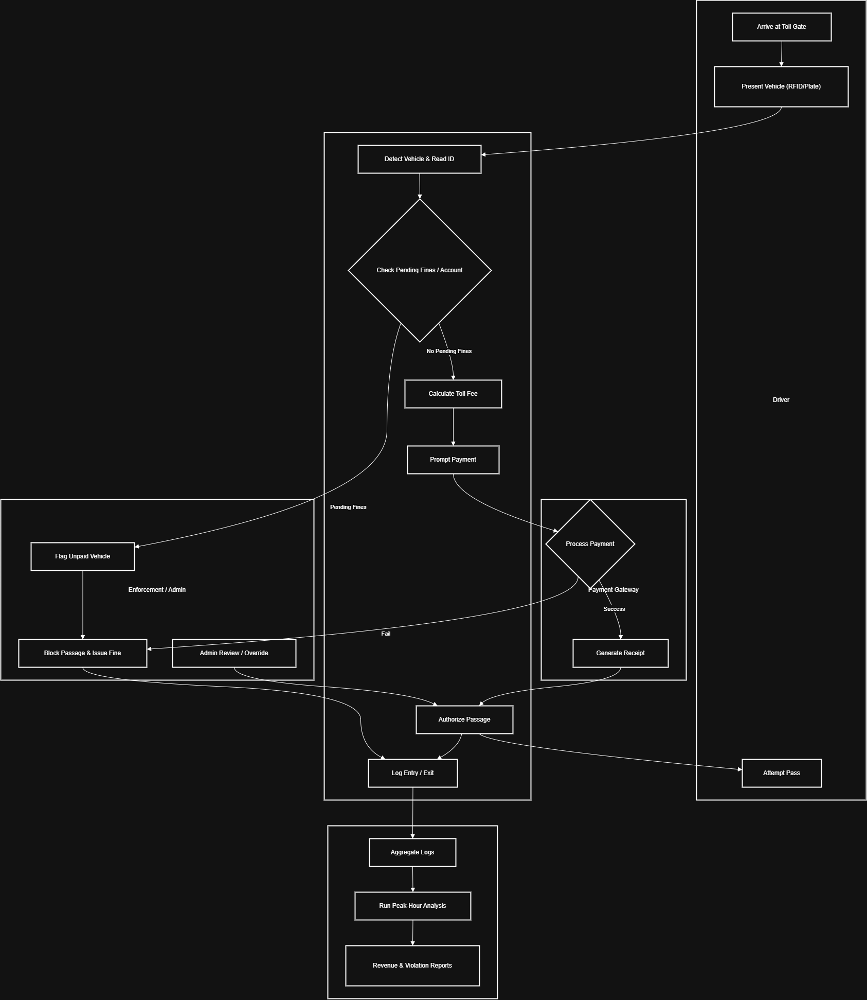

# 🛣️ Smart Toll & Traffic Monitoring System  
## Phase II Documentation  
### BPMN Business Process Explanation

---

## 🎯 Scope & Purpose
This process models the **end-to-end operations at a toll gate**: vehicle detection, fine verification, toll calculation, payment enforcement, entry/exit logging, and analytics aggregation for decision-making.  

The system automates high-volume toll operations while ensuring **accuracy, accountability, and efficiency**.

---

## 🖼️ Business Process Model (BPMN)

---

## 👥 Actors & Roles

- **Driver** – Approaches toll gate, presents vehicle, completes payment, and passes through.  
- **Toll System** – Detects vehicle, reads plate/RFID, checks fines, calculates toll, prompts for payment, logs events, and controls the gate barrier.  
- **Payment Gateway** – Processes digital payments (mobile money, bank card, RFID wallet) and generates receipts.  
- **Enforcement** – Handles unpaid fines, blocks unauthorized passage, issues fines, and overrides system when needed.  
- **Traffic Monitoring** – Aggregates logs, analyzes peak hours, produces dashboards, and identifies trends.  

---

## 🔄 Primary Workflow

1. Vehicle approaches toll gate; **RFID system detects and identifies** the vehicle.  
2. Toll system retrieves vehicle record and **checks for unpaid fines**.  
3. If valid, the system **calculates toll fee** and prompts driver for payment.  
4. Payment gateway **processes the transaction** and returns approval.  
5. Toll system **opens barrier** and logs entry/exit with timestamps and payment status.  
6. Logs flow to **BI layer** for analytics and reporting.  

---

## ⚠️ Exception Paths

- **Pending fines** – System blocks driver; enforcement issues fine or requests payment.  
- **Payment failure** – Transaction retried; barrier remains closed.  
- **Read failure** – Vehicle directed to a manual lane; logged into **SYSTEM_ERROR_LOGS** for technical review.  
- **Emergency overrides** – Admin may allow vehicles with special permissions.  

---

## 🗄️ Data Artifacts

- **Vehicles** – Registered vehicle data  
- **Toll Logs** – Entry, exit, payment status, timestamps  
- **Payments** – All toll and fine payments  
- **Vehicle Fines** – Violations and fine details  
- **Toll Gates** – Data for each gate and lane  

---

## 📊 BI Opportunities

- **Peak-hour traffic analysis** - **Daily, weekly, monthly revenue analysis** - **Fine enforcement rate tracking** - **Lane performance and throughput monitoring** - **Sensor error detection** - **Predictive congestion and maintenance insights** ---

*This business process ensures accurate revenue collection, reduced congestion, proper enforcement, and strong analytical support for government planning.*